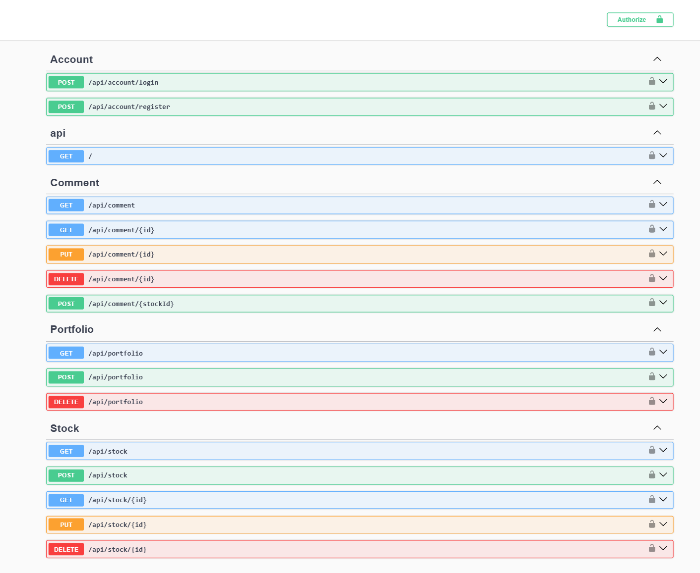
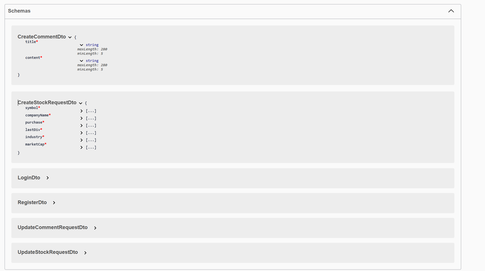

# Stock Portfolio Management API

A **ASP.NET Core Web API** for managing stock portfolios, built with clean architecture principles and modern backend practices.

---

## 🌻 Features

- 🐯 Manage stock portfolios and transactions
- 🐯 Supports **one-to-many** and **many-to-many** relationships using Entity Framework Core
- 🐯 Clean separation of concerns with **DTOs**
- 🐯 Scalable data access using the **Repository Pattern**
- 🐯 Secure authentication and authorization with **ASP.NET Identity**
- 🐯 Dependency Injection for maintainable and testable code

---

## 🌻 Tech Stack

- ASP.NET Core Web API
- Entity Framework Core
- SQL Server
- ASP.NET Identity
- C#

---

## 🌻 Screenshots

### Swagger API Preview




---

## 🌻 API Endpoints

### 🌻 Account

- `POST /api/account/login`
- `POST /api/account/register`

---

### 🌻 API Health

- `GET /`

---

## 🌻 Comment

- `GET /api/comment`
- `GET /api/comment/{id}`
- `PUT /api/comment/{id}`
- `DELETE /api/comment/{id}`
- `POST /api/comment/{stockId}`

---

### 🌻 Portfolio

- `GET /api/portfolio`
- `POST /api/portfolio`
- `DELETE /api/portfolio`

---

### 🌻 Stock

- `GET /api/stock`
- `POST /api/stock`
- `GET /api/stock/{id}`
- `PUT /api/stock/{id}`
- `DELETE /api/stock/{id}`

---

## 🌻 Architecture & Design

- **DTO Pattern** – Decouples API contracts from domain models
- **Repository Pattern** – Abstracts data access logic
- **Dependency Injection** – Promotes loose coupling
- **Relational Modeling**
  - One-to-Many (User → Portfolio)
  - Many-to-Many (Portfolio ↔ Stocks)

---

## 🌻 Authentication

- ASP.NET Identity integration
- User registration & login
- Role-based authorization

---

## 🌻 Getting Started

```bash
git clone <your-repo-url>
cd <project-folder>
dotnet restore
dotnet build
dotnet ef database update
dotnet run
```

---

## 🌻 Future Improvements

- Real-time stock price integration
- Portfolio analytics
- Caching
- Unit & integration tests

---
